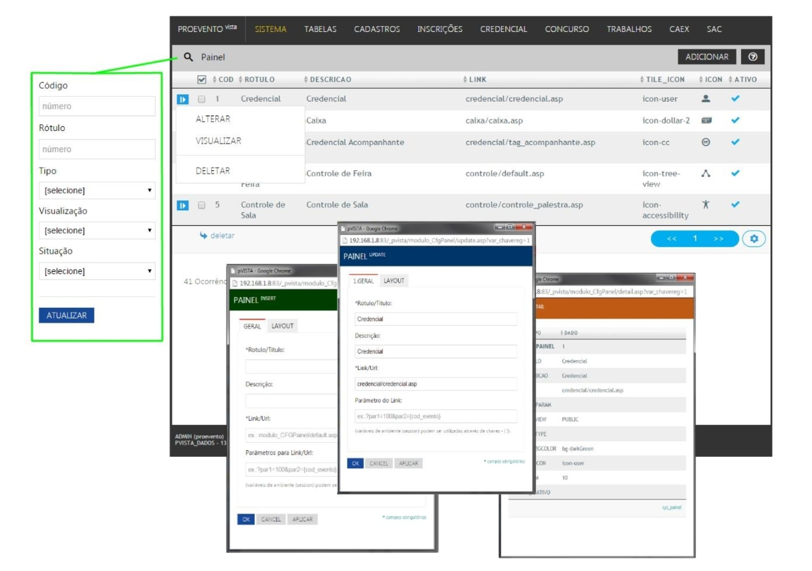

# PVISTA-INTERFACE
My MetroDocUI aplication samples for a project called pvista.

The project was implemented as work for PROEVENTO in the 2010s, as a new interface following the Microsoft Metro UI standards.

<table width:100%>
  <tr>
    <td></td>
    <td></td>
    <td></td>
    <td></td>
    <td></td>
</tr>
</table>
